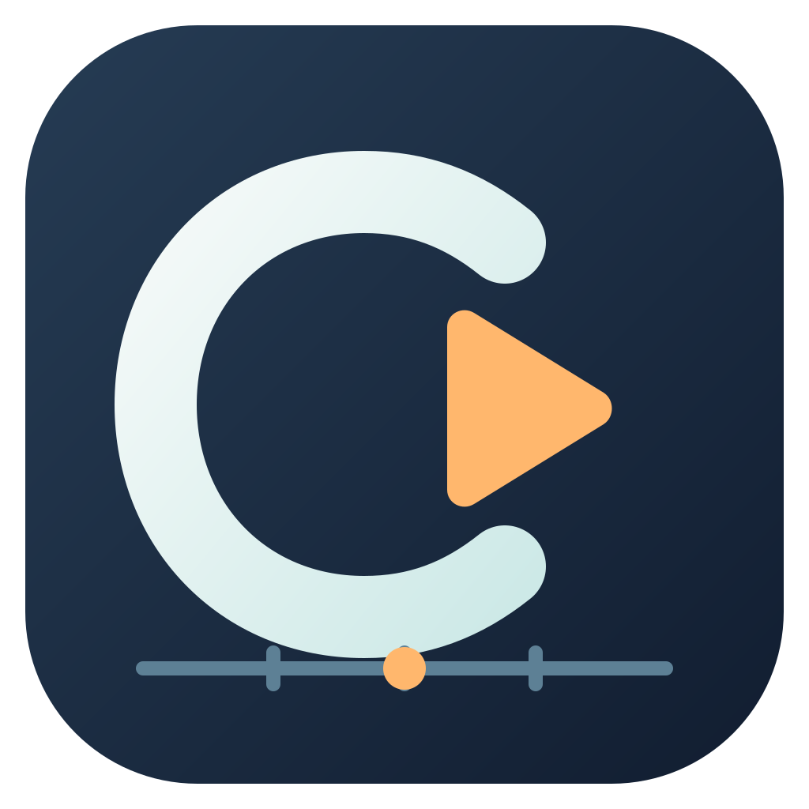

# ChordCue



**跟随 Logic Pro 播放头的和弦谱、级数谱与局域网同步节拍器。**

ChordCue 是独立的 macOS 应用。读取 Logic Pro 已有和弦轨与播放位置，用大字和小节网格帮助边看边演奏；也能把同步谱面投放给局域网内的其他人。

> 当前宿主仅支持 macOS 上的 Logic Pro。Windows、FL Studio、Cubase 和 iReal Pro HTML 导入是待实现计划，欢迎贡献 PR。

## 功能

- 按 Logic 小节与起拍显示和弦，突出当前和弦，随窗口宽度调整布局。
- 实时显示当前工程名、拍号和 BPM；速度来自 Logic，不自行分析歌曲 BPM。
- 和弦／级数切换、显示移调、自动定调和候选转调检测；支持手动定调及转调点。
- 导出和弦谱或级数谱 PDF，支持轨道原样、C 调、已指定的移调前原调和当前显示调。
- 局域网投放：其他人浏览器即可跟谱；移调、级数、音量及节拍设置彼此独立。
- 同步经典节拍器／鼓机，与和弦谱同时使用。八分音符模式下 4/4 有 8 根三格柱，0–3 格表示静音、轻拍、正常、重拍。
- 窗口缩放、置顶开关；不改变 Logic 工程、伴奏音高或音频。

## 安装：从源码构建

当前提供源码构建方式，尚未提供经 Apple 公证的下载版应用。

需要 macOS 13+、Xcode Command Line Tools，以及带有和弦轨的 Logic Pro。源码依赖 SwiftUI、AppKit、WebKit、ApplicationServices、Network 等系统框架，无第三方运行时包依赖。当前在 Apple Silicon 上验证；Intel 构建入口可用，但尚未实机验证。

```bash
xcode-select --install
git clone https://github.com/Gonghysin/ChordCue.git
cd ChordCue
bash scripts/build.sh
open build/ChordCue.app
```

如果 Command Line Tools 已安装，跳过第一条。正式使用建议退出 ChordCue 后安装到固定位置：

```bash
bash scripts/install.sh
open /Applications/ChordCue.app
```

安装会覆盖目标目录中同名的 ChordCue.app；默认使用临时签名。持续开发时建议配置自己的固定代码签名身份，减少更新后重复授权。完整步骤见 [安装与签名](docs/INSTALL.md)。

可选安装 `librsvg` 以生成 Dock 图标；缺少时仍可构建：
```bash
brew install librsvg
bash scripts/build.sh
```

## 快速开始

1. 打开 Logic 工程，让全局 **Chord／和弦轨** 可见。建议 Logic 显示语言使用英语，目前辅助功能位置与和弦解析依赖英语字段。
2. 启动 ChordCue，点“辅助功能授权”，在系统设置 → 隐私与安全性 → 辅助功能中允许 ChordCue。
3. 点“刷新 Logic 和弦”，在 Logic 播放或定位，观察当前小节与和弦。
4. 选择和弦／级数及显示调；若调性判断不准，用“调性设置”指定。
5. 开启节拍器后切回和弦谱，可以同时看谱和听拍。细分、音量和重音在节拍器页设置。
6. 多人演奏时，开启“局域网投放”，把完整访问链接发给同一局域网内的成员。

未连接 Logic 时显示仓库自带的原创演示和弦；也可用“备用输入”手动填写。`No Out` 不影响读取，无需 MIDI 输出。

详细操作见 [使用手册](docs/USER_GUIDE.md)；常见问题见 [安装与故障排查](docs/INSTALL.md)。

## 已知限制

- 和弦来源是 Logic 的和弦轨，ChordCue 不从音频重新识别和弦。
- 定调仅依据和弦，不能保证唯一判断关系大小调；转调位置是候选结果，允许手动修正。
- 目前未接入完整的历史／未来变拍号和速度地图，不能保证所有变奏边界的布局与声音排程正确。
- 节拍器暂支持四分音符为拍单位的 1–12 拍；其他分母的拍号暂停同步发声。
- 同步依赖辅助功能界面更新、采样、网络和设备输出延迟；不是采样级同步，也不是专业无线耳返。
- 当前读取逻辑依赖 Logic 的辅助功能结构；软件更新或语言差异可能需要适配。
- 局域网为 HTTP，访问链接持有者可读谱；不建议映射到公网。

## 贡献与路线图

欢迎 Issue 和 PR！优先方向：

- Windows 桌面端与跨平台宿主接口。
- FL Studio、Cubase 等宿主适配。
- iReal Pro HTML／分享链接和弦谱导入，独立播放头与局域网共享。
- 更完整的变拍号、速度地图和同步校准。

详见 [TODO](TODO.md) 和 [贡献指南](CONTRIBUTING.md)。

## 项目结构

```text
Sources/       macOS 应用、Logic 读取、乐理、PDF 和 LAN 服务
Resources/     网页跟谱端、节拍器、图标和原创演示数据
scripts/       构建与安装
docs/          安装及使用手册
tools/         可选离线调性对照工具
licenses/      参考项目许可证
```

## 开源协议与致谢

ChordCue 代码采用 [MIT](LICENSE)。第三方许可保留独立效力。

参考了 Chris Wilson 的 metronome 排程思路、WhatKey 的稳定调性判断，以及 music21 的公开调性分析资料和离线对照 API；并调研过 Tone.js 和 sync_metronome。应用不打包这些运行时库。具体来源、实现关系、许可证及对应提交见 [THIRD_PARTY_NOTICES.md](THIRD_PARTY_NOTICES.md)。

Logic Pro、FL Studio、Cubase 和 iReal Pro 名称属于各自权利人。本项目为独立社区项目，与这些产品没有隶属或背书关系。
